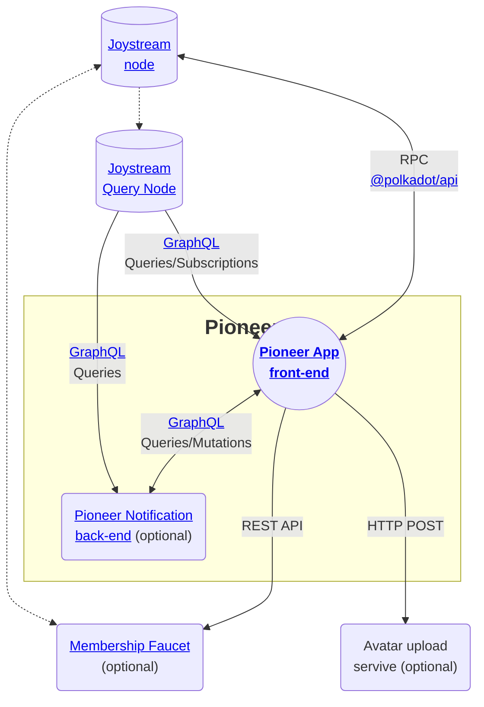

# Developer documentation

## Table of content

- [Pioneer architecture](#)
- [Development](#development)
  - [Development tools](#development-tools)
  - [Pioneer front-end App](#pioneer-front-end-app)
  - [Pioneer back-end](#pioneer-back-end)
  - [Testing](#testing)
  - [Coding standards](#coding-standards)
  - [Dependencies](#dependencies)

## Pioneer architecture

Pioneer is an application which displays information from and interacts with the Joystream node. This is done in a few way throughout the code base:
- It mostly interacts directly with the Joystream node by calling extrinsics via the [Polkadot{.js} API](https://github.com/polkadot-js/api).
- Data are mostly done through the Query Node GraphQL API. However occasionally some data are also read via [Polkadot{.js} API](https://github.com/polkadot-js/api) queries.
- Pioneer also connect to the [Membership Faucet](https://github.com/Joystream/membership-faucet) to creates memberships.

In addition to these services 3 services memberships Avatars are uploaded and served by `https://atlas-services.joystream.org/avatars`.

Finally Pioneer is composed of 2 services a front-end application and a back-end which handle e-mail notifications. They interact via GraphQL.

Here is a summary of the involved services:



## Development

### Development tools

In order to work on Pioneer 2 you'll need following tools for development and testing:

- [Node.js](https://nodejs.org) `v18.x` or newer.
- [yarn](https://yarnpkg.com/getting-started/install)

In order to interact with the Joystream ecosystem

- [Joystream node](https://github.com/Joystream/joystream/tree/master/bin/node) _optional_
- [Joystream Query node](https://github.com/Joystream/joystream/tree/master/query-node) _optional_


### Pioneer front-end App

> [!NOTE]
> Read more about the Pioneer front-end App architecture and key concepts [here](/packages/ui/README.md).


 To start Pioneer run:
 ```shell
 yarn start
 ```

As shown above the Pioneer front-end relies on the state of the Joystream blockchain (exposed by the Joystream node and Query node). Therefore it is necessary to connect Pioneer to instances of the Joystream node and query node or to mock these in order to be able to develop on Pioneer.

#### Method 1: Developing on mocks with Storybook

The Pioneer Storybook has several stories rendering entire pages including the pages modal. This can be used to add features and tests. It allows to easily mock any possible chain state and can result in a faster development cycle.

To start Storybook run:
```shell
yarn storybook
```

It should be accessible at `localhost:6006`.
There are to section particularly useful to develop:
1. [App](https://pioneer-2-storybook-joystream.vercel.app/?path=/story/app) these stories allow to interact with non domain specific feature like the On boarding flow or the sidebar.
2. [Pages](https://pioneer-2-storybook-joystream.vercel.app/?path=/story/pages) these stories render the pages based on fully mocked data (which can partially be changed through the stories controls).

> [!IMPORTANT]
> After developing a feature using a story, the feature should still be tested on the app with an actual network.

Read more about the Storybook mocks [here](mocks.md#storybook-mocks).

#### Method 2: Connecting to the Joystream main network (Mainnet)

Pioneer will by default connect to the Joystream main network. This can be enough to develop or develop feature based on the current version of the Mainnet chain, however changing state of the Mainnet for development is costly, time consuming, and should be avoided in most cases.

> [!TIP]
> To make sure that Pioneer is connected to the Mainnet go to the Settings on the "Network" tab the "Select Network" should be set to "Mainnet". Additionally "Network Details" section (on the same page) can be checked to make sure the environment variable are indeed pointing to the Mainnet.

#### Method 3: Connecting to a Joystream playgrounds

Alternatively some "playgrounds" are available to help with Pioneer's development, these are networks based on chains with tokens which have no real values and which might be configured to make testing easier (e.g election cycle may run in minutes instead of weeks).

Read how to connect to these networks [here](/packages/ui/README.md#using-custom-joystream-networks).

#### Method 4: Connecting to a local Joystream dev environment

Read the [Running the Joystream ecosystem locally](testenv.md) docs on how to run Pioneer with a local Joystream network.

### Pioneer back-end

> [!NOTE]
> Read more about the Pioneer backend architecture and key concepts [here](/packages/server/README.md).

To run the Pioneer back-end locally:

1. Install the dependencies: `yarn --immutable`:
2. Create and configure a `packages/server/.env`.
3. Prepare the database and generate the code by running either:
    - `yarn workspace server dev:db:build`: To use docker for the db.
    - Otherwise `yarn workspace dev:build`: Once the configured db is running.
4. Start the API server with: `yarn workspace server dev:api`
5. To run the notifier: `yarn workspace server dev:notify`

### Testing

Read about testing in [testing documentation](tests.md).

### Coding standards

For code quality & standards we rely on ESLint and Prettier. To run both checks execute inside `packages/ui`:

```shell
## Run linter
yarn lint

## Run lint & apply automatic fixes
yarn lint:fix
```

### Dependencies

The package.json entries for `@polkadot/*` packages must be set to the exact versions in order to match Joystream dependencies. See `resolutions` section in [package.json](/package.json) for details. Keeping dependencies in sync prevents "duplicated instances" error while using Polkadot.js API.

The CKEditor 5 build is available in `packages/markdown-editor` packages. [More on editor development](/packages/markdown-editor/README.md).

