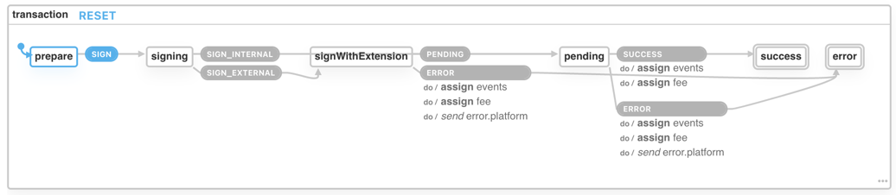

# Pioneer 2 architecture & concepts

## Directory structure

The application is divided to 3 types of building blocks:

* `common` - commonly used components & utilities not tied to specific domain
* A domain/use-case specific:
  * `accounts` – domain of Polkadot's accounts handling, transfering tokens, balances, etc
  * `council` – [council governance](https://joystream.gitbook.io/joystream-handbook/governance/council)
  * `forum` - [forum subsystem](https://joystream.gitbook.io/joystream-handbook/subsystems/forum)
  * `memberships` - [memberships management](https://joystream.gitbook.io/joystream-handbook/subsystems/membership)
  * `working-groups`
    – [working group governance](https://joystream.gitbook.io/joystream-handbook/governance/working-groups)
  * `proposals` – [proposal system](https://joystream.gitbook.io/joystream-handbook/governance/proposals)
* `app` – Anything related to the application
  * assets
  * routing
  * pages
  * global providers
* `mocks` Query-node mocks.

Some rules/hints:

- More general packages should not import anything from more specific packages. So code inside `common` cannot import
  from `accounts` or `app`.
- Domain specific code can import from other domains and `common` as you can display account select component when
  creating membership.
- The app folder describes how the application is wired-up.

The common and domain specific code is split by functionality:

* `components` - Contains React components
* `hooks` - Contains react hooks
* `modals` - Contains specific modals
* `model` - Contains business logic like validation, helpers, etc.
* `queries` - Contains domain specific queries
* `types` - TypeScript types
* `providers` - React context providers

## Concepts

Most of the Pioneer 2 uses common React app coding patterns. Some however, requires additional explanation.

### Modals

The modals can be created as:

- locally included component
- or by requesting to show a global modal using `useModal()` hook:

The global modals should be included in `<GlobalModals />` component. After that can be instantiated from anywhere in
the app.

#### Modals with steps

Some modal's flows require a complex state handling. For those the Pioneer 2 app uses transitions defined using xstate
library.

To add a stepper add the proper `meta` key to the state definition:

```ts
const state = {
  id: 'state',
  meta: { isStep: true, stepTitle: 'First Step' }
}
```

If the states are nested, they will be rendered by `@/common/model/machines/getSteps()` helper as a nested steps.

Example machine that uses nested steps:

```ts
export const myMachine = createMachine<Context, Event, State>({
  initial: 'setup',
  states: {
    setup: {
      id: 'setup',
      meta: { isStep: true, stepTitle: 'Setup' },
      on: { NEXT: 'general' },
    },
    general: {
      id: 'general',
      initial: 'stakingAccount',
      meta: { isStep: true, stepTitle: 'General parameters' },
      states: {
        title: {
          meta: { isStep: true, stepTitle: 'Title' },
          on: {
            BACK: '#setup',
            NEXT: 'description'
          },
        },
        description: {
          meta: { isStep: true, stepTitle: 'Description' },
          on: {
            BACK: 'title',
            NEXT: 'end',
          },
        },
        end: {
          type: 'final',
        },
      },
      onDone: 'transaction',
    },
    tranasction: {}
  }
})
```

#### Transactions

For any transaction we use a dedicated [machine](/packages/ui/src/common/model/machines/transaction.ts)



The transaction machine should be used as invoked actor:

```ts
// machine.ts
const machine = createMachine({
  states: {
    transaction: {
      invoke: {
        id: 'transaction',
        src: transactionMachine,
        // Automatic transition to the next state
        onDone: [
          {
            target: 'success',
            // Save events to process responses & errors
            actions: assign({ transactionEvents: (context, event) => event.data.events }),
            // Transition guard
            cond: isTransactionSuccess,
          },
          {
            target: 'error',
            actions: assign({ transactionEvents: (context, event) => event.data.events }),
            cond: isTransactionError,
          },
          {
            target: 'canceled',
            cond: isTransactionCanceled,
          },
        ],
      },
    },
    success: { type: 'final' },
    error: { type: 'final' },
    canceled: { type: 'final' },
  }
})
```

The transaction machine can be used either as a standalone machine or as a child of a bigger flow.
